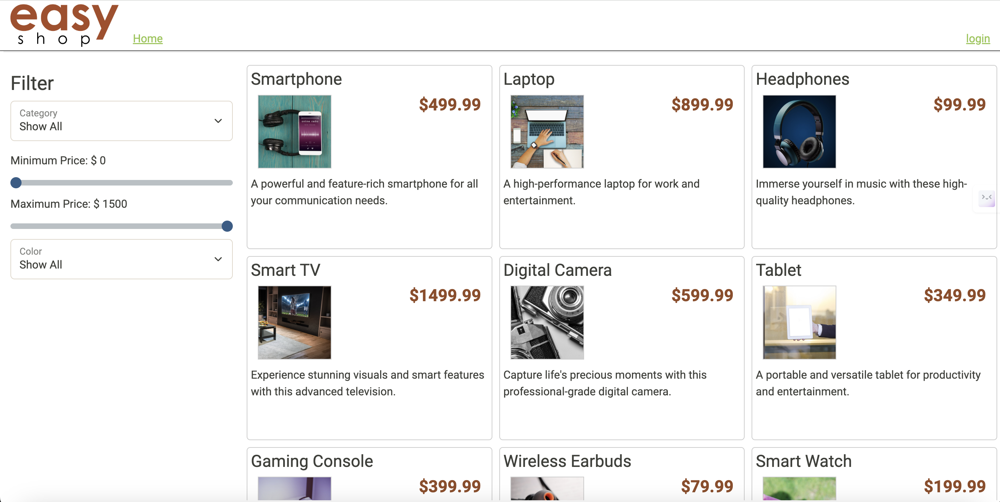

# EasyShop Capstone Project

## Description of the Project

EasyShop is a fully functional e-commerce website with a Spring Boot API backend and a MySQL database for data storage. 
It allows users to log in, browse products in various categories and prices, add them to a shopping cart, and check out to order the products. 
The project involves fixing existing bugs in the API code and implementing new features, all while ensuring the backend functions smoothly.

## User Stories

List the user stories that guided the development of your application. Format these stories as: "As a [type of user], I want [some goal] so that [some reason]."

- As an admin, I want to retrieve all categories so that I can view and manage all available categories in the system.
- As an admin, I want to retrieve a specific category by its ID so that I can review its details.
- As an admin, I want to create a new category so that I can expand the available categories in the system.
- As an admin, I want to update an existing category so that I can correct or modify its details.
- As an admin, I want to delete a category so that I can remove it if it is no longer relevant.
- As a user, I want to search for products based on category, price range, and color so that I can find items that match my preferences.
- As a user, I want to view the details of a specific product so that I can learn more about its features.
- As an admin, I want to add a new product so that I can expand the inventory.
- As an admin, I want to update an existing product so that I can correct its information or modify its availability.
- As an admin, I want to delete a product so that I can remove outdated or unavailable items.

## Setup

Instructions on how to set up and run the project using IntelliJ IDEA.

### Prerequisites

- IntelliJ IDEA: Ensure you have IntelliJ IDEA installed, which you can download from here.
- Java SDK: Make sure Java SDK is installed and configured in IntelliJ.
- MySQL: Set up a MySQL database and import the schema for categories and products.

### Running the Application in IntelliJ

Follow these steps to get your application running within IntelliJ IDEA:

1. Clone the repository to your local machine.
2. Open IntelliJ IDEA.
3. Select "Open" and navigate to the directory where you cloned the project.
4. After the project opens, wait for IntelliJ to index the files and set up the project.
5. Locate the main class in the Spring Boot application.
6. Run the application by right-clicking on the main class and selecting 'Run'.
7. Access the REST API endpoints via http://localhost:8080.

## Technologies Used

- Java: Version 11 or higher.
- Spring Boot: For REST API development.
- MySQL: For database management.
- Maven: For dependency management.
- Postman: For testing and documenting REST APIs.

## Demo

-Web demonstration 
-Postman demonstration 

## Future Work

Outline potential future enhancements or functionalities you might consider adding:

- Payment Integration = Integrate secure payment gateways like PayPal, Stripe, or credit card processing to enable seamless transactions.
- Order Management System = Add functionalities for order tracking, status updates (e.g., pending, shipped, delivered), and email notifications for order confirmations.
- Advanced Product Search and Filters = Implement advanced filters such as sorting by popularity, reviews, or new arrivals.

## Resources

List resources such as tutorials, articles, or documentation that helped you during the project.

- https://yearup.brightspace.com/d2l/home
- https://www.w3schools.com/java/
- https://github.com/RayMaroun

## Team Members

- **Name 1** - Taha Bilmen

## Thanks

Express gratitude towards those who provided help, guidance, or resources:

- Thank you to Raymond for continuous support and guidance.
- A special thanks to Ekrem Alp for their dedication and teamwork.